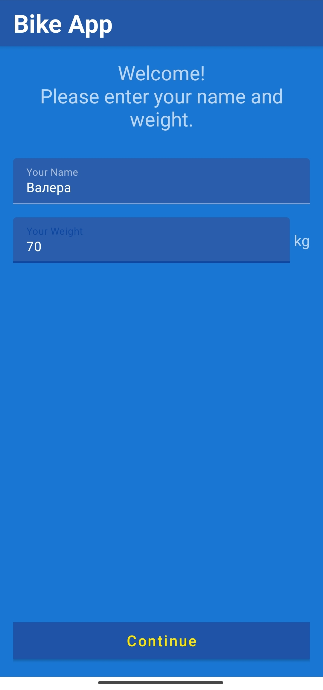
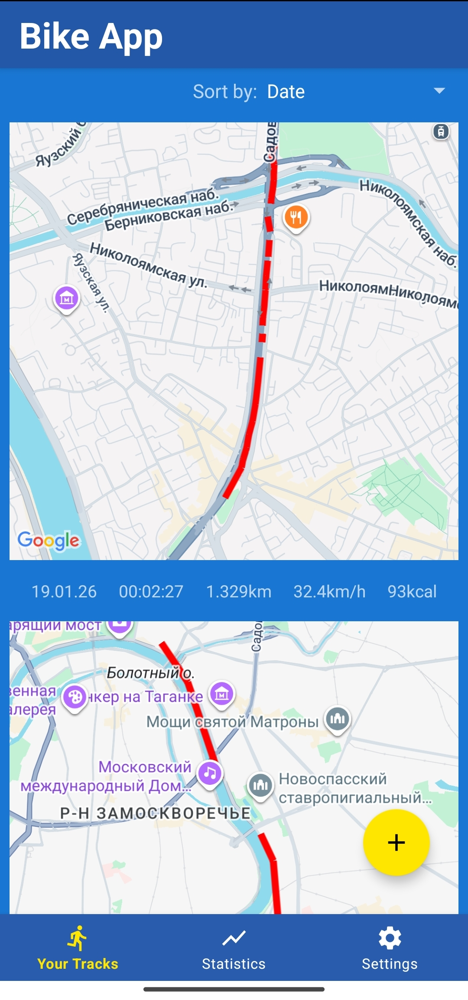
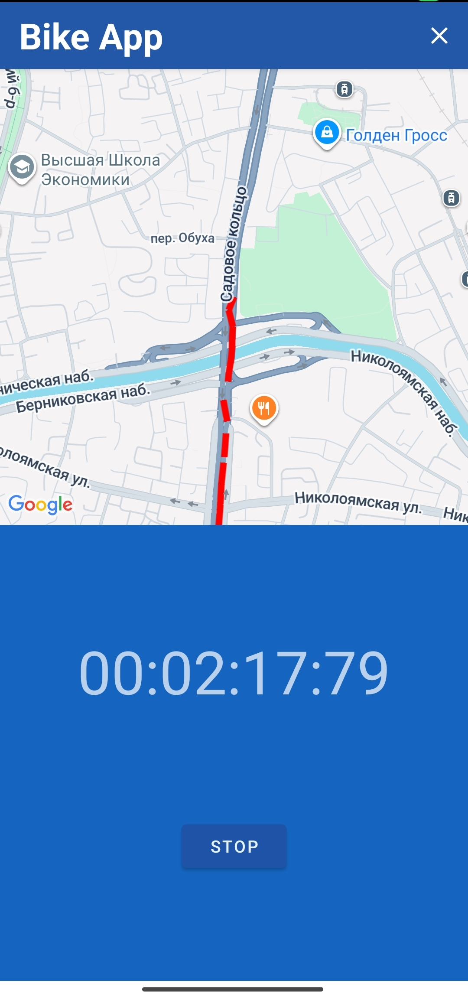
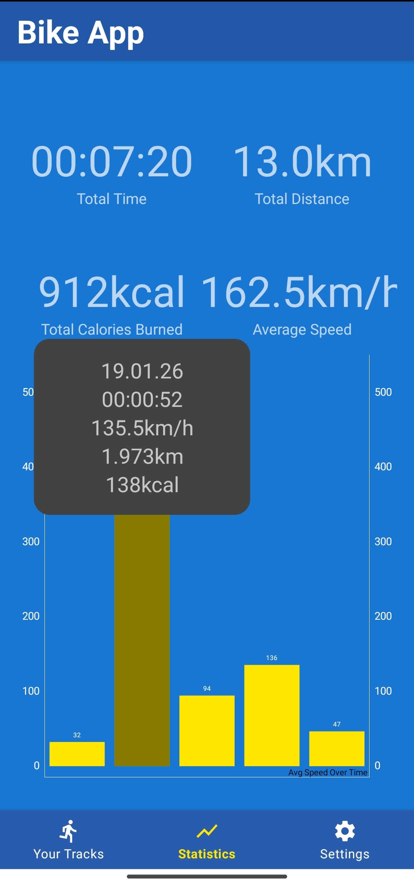

# 🚴 BikeApp - Велотрекер для Android
**BikeApp** - это Android-приложение для отслеживания велосипедных поездок, которое позволяет записывать маршруты, рассчитывать статистику и сожженные калории.

## Скриншоты приложения

**1. Ввод имени и веса**

**2. Список маршрутов**

**3. Активная поездка с таймером**

**4. Статистика заездов с гистограммой**

## Функционал
- 🗺️ Отслеживание маршрутов в реальном времени с использованием GPS

- 🔥 Расчет сожженных калорий на основе веса пользователя и пройденной дистанции

- 📊 Детальная статистика по каждой поездке (скорость, расстояние, время)

- 📈 Визуализация данных с помощью гистограммы средних скоростей

- 💾 Локальное хранение всех поездок в базе данных

- 🎯 Простой интерфейс с навигацией между 4 основными экранами

## Архитектура и технологии
Приложение разработано с использованием современных Android-технологий:

### Основные технологии
| Технология |	Назначение | Версия
|----------------|:---------:|----------------:|
| Kotlin	| Основной язык разработки	| 1.9+
Material 3 |	Дизайн-система |	Material3
AndroidX	| Современные Android библиотеки | 

### Хранение данных
- **Room Database** - локальное хранение маршрутов и статистики

- **Coroutines** - асинхронные операции с базой данных

- **Flow** - реактивные потоки данных

### Навигация
- **Navigation Component** - навигация между экранами

- **Hilt** - dependency injection для управления зависимостями

### Геолокация и карты
- **Google Maps SDK** - отображение карт и маршрутов

- **Play Services Location** - получение GPS-данных

- **Lifecycle Service** - фоновое отслеживание местоположения

### Визуализация
- **MPAndroidChart** - построение гистограмм и графиков

- **Glide** - загрузка и кэширование изображений
